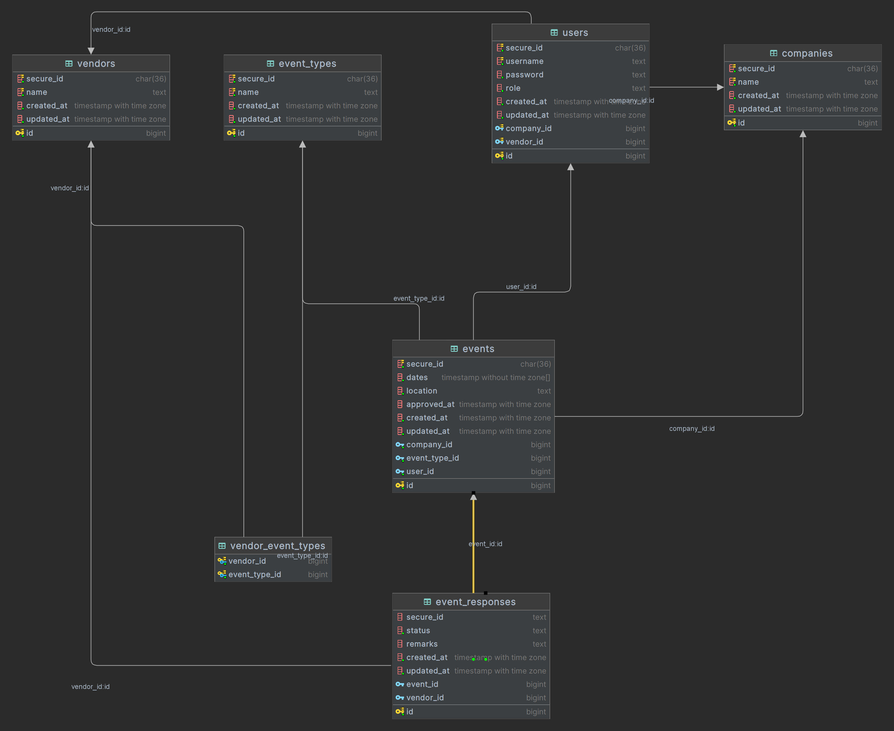
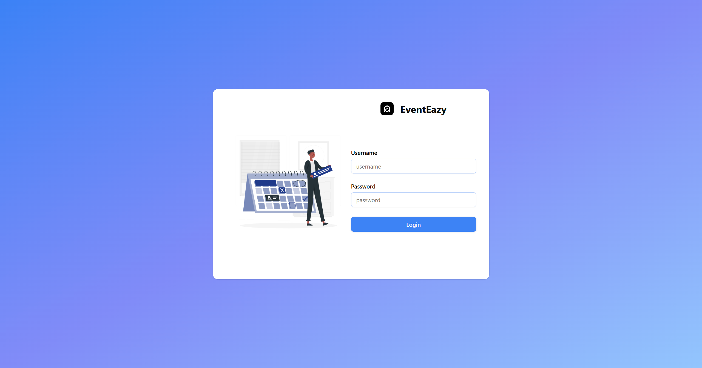
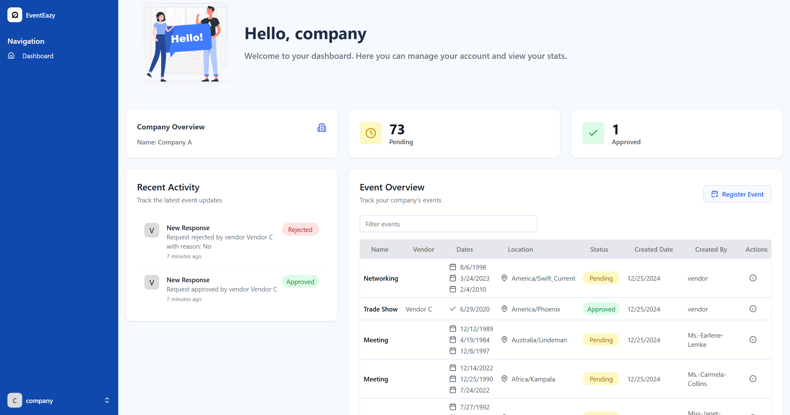
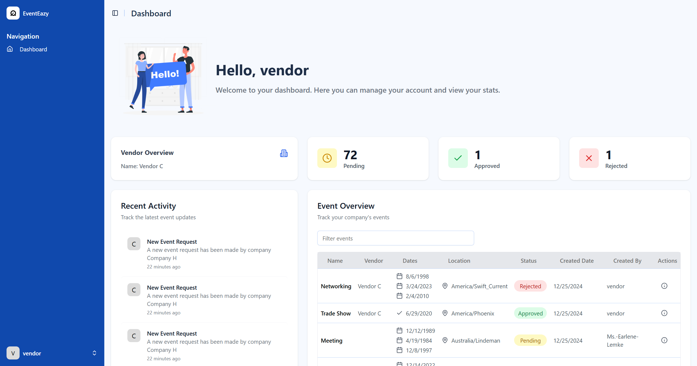

# Event Booking System

A full-stack web application facilitating online event booking and vendor management, built with React, Go, and PostgreSQL.

## Deployment Demo

- **Frontend**: [https://embreo.robertwl.my.id](https://embreo.robertwl.my.id)
- **Backend**: [https://embreo-be.robertwl.my.id/swagger/index.html](https://embreo-be.robertwl.my.id/swagger/index.html)

Dummy credentials:
- **HR Admin**: 
    - Username: `company`
    - Password: `company`
- **Vendor Admin**:
    - Username: `vendor`
    - Password: `vendor`

## Features

- **User Authentication**
    - Role-based access control (HR Admin & Vendor Admin)
    - Login system
    - Session management using JWT tokens

- **HR Admin Features**
    - Create events with multiple proposed dates
    - View all company events
    - Track event status and vendor responses
    - Recent event updates

- **Vendor Admin Features**
    - View assigned events
    - Approve/reject event requests
    - Select preferred dates
    - Provide rejection remarks
    - Vendor-specific event filtering
    - Recent event updates

## Tech Stack

### Frontend
- React.js
- TypeScript
- TailwindCSS
- Axios
- Zod
- React Hook Form
- React Query
- React Table
- React Router
- Shadcn/ui

### Backend
- Go (Golang)
- Gin
- GORM
- JWT
- Swagger

### Database
- PostgreSQL
- Database migrations using GORM

## Prerequisites

- Node.js (v18+)
- PNPM
- Go (v1.20+)
- MySQL (v8+) or PostgreSQL (v14+)
- Docker (optional, for containerization)

## Getting Started

### Local Development Setup

1. **Clone the repository**
   ```bash
   git clone https://github.com/robert-wl/embreo-test.git
   cd embreo-test
   ```

2. **Backend Setup**
   ```bash
   cd backend

   go mod tidy
   
   cp .env.example .env
   
   # either use make or go
   make run 
   go run ./cmd/main.go
   ```

3. **Frontend Setup**
   ```bash
   cd frontend
   
   pnpm install
   
   cp .env.example .env
   
   pnpm run dev
   ```

### Docker Setup

```bash
cp .env.docker.example .env.docker

docker-compose --env-file .env.docker -f docker-compose.server.yml up --build -d
```

## Project Structure

```
.
├── backend/
│   ├── cmd/
│   ├── config/
│   │   └── main.go
│   ├── docs/
│   ├── internal/
│   │   ├── application/
│   │   │   ├── dto/
│   │   │   ├── handler/
│   │   │   └── service/
│   │   ├── domain/
│   │   │   ├── model/
│   │   │   ├── repository/
│   │   │   └── service/
│   │   └── infrastructure/
│   │   │   ├── db/
│   │   │   ├── http/
│   │   │   └── repository/
│   ├── pkg/
│   │   ├── pagination/
│   │   └── utils/
├── frontend/
│   ├── public/
│   ├── src/
│   │   ├── assets/
│   │   ├── components/
│   │   ├── context/
│   │   ├── hooks/
│   │   ├── lib/
│   │   ├── pages/
│   │   ├── service/
│   │   ├── main.tsx
│   │   └── App.tsx
│   └── package.json
└── docker-compose.server.yml
```
## API Documentation

API documentation is available via Swagger UI at `/swagger/index.html` when running the backend server.

## Database Schema

### ERD Diagram



## Application Demo

### Login Page



### HR Admin Dashboard



### Vendor Admin Dashboard


